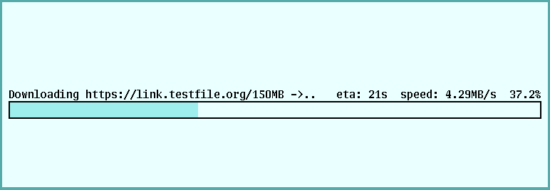

# dl

	dl [ -o output ] [ -ax ] url

Dl is a graphical alternative to hget(1) and is used for downloading
files from the world wide web.  It provides the user with a progress
bar, the estimated time when the download will finish and the current
downloading speed in a human readable format.

The -o flag specifies the name of the output file.

The -a flag sets the output file name to that of the parsed URL.

The -x flag prevents dl from qutting once the file has been
downloaded.

Dl will write the downloaded chunks to standard output if -a
nor -o has been set.

## Usage
As specified in the manual, dl can be used in a lot of different ways,
here are some to list a few:

`dl -a https://link.testfile.org/15MB` the name of the output file is
determined by the URL

`dl -o myfile https://link.testfile.org/15MB` the output file will be
named myfile.

`dl https://link.testfile.org/15MB >out` redirect stdout to a file
called out.

## Bugs
Dl does not implement all of hget(1)'s features.

Dl does not validate the URL passed to it, nor the output file name
and will crash if started with bogus parameters.

## License
MIT
